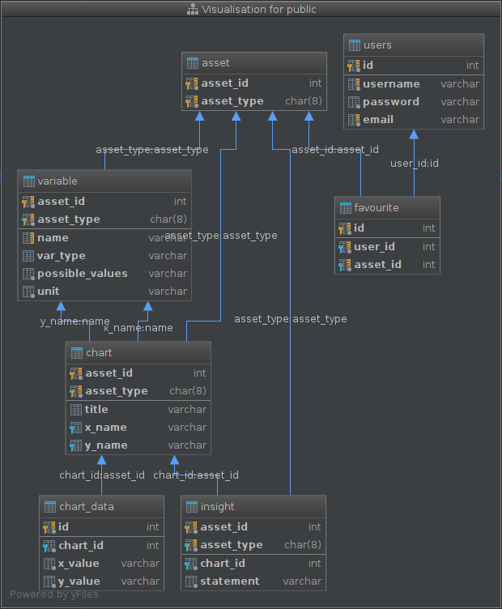

# RESTful API in GO
This first-time experience in Go was a great one, developing a web-based, database-backed (PostgreSQL) application.

&nbsp;

Due to the shortage of time I have not managed to implement all feature that I wanted. Starting with the most important and continuing in decreasing order I will mention those:

- testing all controllers; not only the major (with favourites)
- testing of database connections and repositories
- JWT Token/ Handling Authentication for the service
- Certificates and serving over TLS
- go routines and channels
- Object Relational Mapper (GORM); instead of the normal pg library
- Full CRUD for resources (omitted; time was of the essence)

&nbsp;

## Getting Started

Deploying/Running the application. 

1. Locate docker-compose.yml file and then from the same directory containing the file, launch containerized PostgreSQL database as service.

2. Connect to the running container in order to run ddl script that creates role, database owned by role and finally our relational schema. Using Docker volumes, the shared file (initdb.sql) is located at container's root directory.

3. To start the Go application, first the appropriate image must be built from another container, using instructions declared in a build script. Locate Dockerfile file.

4. Locate docker-compose.yml file and then from the same directory containing the file, launch containerized go-webservice, as service.

After that, the API is ready to be consumed at `http://0.0.0.0:8080`.

&nbsp;

## How to use endpoints

Consuming the application

- Go to <a href="https://gwichallengeapi.docs.apiary.io/">apiary.io</a> api page, I've created for the API Documentation.

and/or 

- API client tools like `Postman`, let us handle complicated operations easily. Explore Postman exported collection provided as a JSON file `gwi-webservice.postman_collection.json`.

&nbsp;

## It works, on my computer! 

True story, I've already deployed it <a href="http://demetrius.ddns.net:8080">here</a>!

Have fun!

&nbsp;

## Database scheme

Database Design Decisions

<b>Please, refer to the `initdb.sql` that contains comments which relate to the definition of concepts, and assumptions taken while designing and implementing this project.<b>

&nbsp;

`initdb.sql` also contains:

- the complete SQL DDL data definition for the challenge,
- the necessary SQL DML data manipulation for the challenge, sample data for each of the relations defined in the DDL section.

&nbsp;

